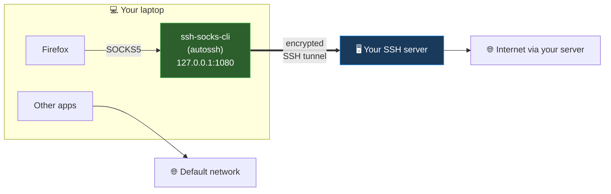
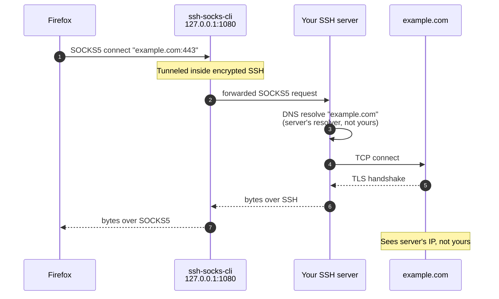

# ssh-socks-cli

> **Archived.** This repository is no longer actively maintained.

> Manage an SSH SOCKS5 tunnel and configure Firefox to use it — without typing `ssh -D` every time.

[](LICENSE)
[](https://www.python.org/)
[]()

## What it does

`ssh-socks-cli` is a small CLI that:

1. Manages an SSH-based SOCKS5 tunnel as a background process (using `autossh` when available).
2. Writes the matching SOCKS5 + DNS-leak-prevention preferences to your default Firefox profile.
3. Provides `start`, `stop`, `status`, `logs`, `doctor`, and an interactive `init` for first-time setup.

That's the whole tool. What you do with the tunnel — and whether you should — is up to you.

## You need an SSH server you control

This is a **client**. It connects to an SSH server *you already own*, opens a SOCKS5 tunnel inside that connection, and points Firefox at it. Your Firefox's outbound IP becomes whatever that server's IP is.

Anything running `sshd` and reachable from your laptop works:

- A VPS (DigitalOcean, Hetzner, Linode, Vultr, AWS Lightsail, Fly.io, …) — $3–6/month is plenty.
- A Raspberry Pi at home with `sshd` exposed (port-forward + dynamic DNS if needed). An RPi Zero 2W is enough.
- A home server, NAS, or any always-on Linux machine with SSH.

**The server only needs:**
- `sshd` running and reachable.
- Your public key in `~/.ssh/authorized_keys`.
- Outbound internet.

OpenSSH's `-D` flag *is* a built-in SOCKS5 server, so no extra software is required.

**Verify you can SSH in manually before running `ssh-socks init`:**

```bash
ssh user@your-server.example.com
```

If that doesn't work, fix your SSH access first.

## How it works



Only Firefox is re-routed. Every other app keeps using the default network. This is a per-application proxy, not a system-wide change.

### Single Firefox request



The hostname is resolved at the server, not at your laptop. That's what `network.proxy.socks_remote_dns = true` does — without it, Firefox would resolve via your local OS resolver before sending the request through the tunnel.

## Features

- One-command tunnel lifecycle — `start`, `stop`, `status`, `restart`, `logs`.
- Firefox integration — writes the correct `user.js` block with DNS-leak protection and WebRTC hardening, auto-detecting your default profile.
- Auto-reconnect via `autossh` when available, plain `ssh` with keep-alives otherwise.
- Auto-start on login — `service install` registers the tunnel via systemd (Linux), launchd (macOS), or Task Scheduler (Windows).
- `doctor` command — diagnoses missing binaries, key permissions, host reachability, port availability.
- XDG-compliant config at `~/.config/ssh-socks-cli/config.toml`.
- Zero heavy dependencies — shells out to system `ssh` / `autossh`.
- Cross-platform — macOS, Linux, Windows.

## Prerequisites

**On your laptop:**

- Python 3.11+
- `ssh` (OpenSSH client) — built into modern macOS, Linux, Windows 10/11.
- `autossh` *(optional but recommended)* — for automatic reconnection.
  - macOS: `brew install autossh`
  - Debian/Ubuntu: `sudo apt install autossh`
  - Fedora/RHEL: `sudo dnf install autossh`
  - Arch: `sudo pacman -S autossh`
- Firefox.

**On the server:** `sshd` running and reachable, your key in `authorized_keys`. That's it.

## Installation

```bash
pipx install ssh-socks-cli
```

> [`pipx`](https://pypa.github.io/pipx/) installs CLI tools in isolated virtualenvs. Install it with `brew install pipx`, `apt install pipx`, or `pip install --user pipx`.

Or:

```bash
pip install ssh-socks-cli
```

From source:

```bash
git clone https://github.com/sergioarojasm98/ssh-socks-cli.git
cd ssh-socks-cli
pip install -e .
```

## Quick start

```bash
ssh-socks init                # interactive setup
ssh-socks doctor              # verify environment
ssh-socks start               # start the tunnel
ssh-socks firefox apply       # configure Firefox
# restart Firefox
```

Visit `https://ifconfig.me` to confirm Firefox is exiting through your server.

## Command reference

| Command | Description |
|---|---|
| `ssh-socks init` | Interactively create the config file |
| `ssh-socks start` | Start the SOCKS5 tunnel in the background |
| `ssh-socks stop` | Stop the running tunnel |
| `ssh-socks restart` | Stop + start |
| `ssh-socks status` | Show tunnel status (running/stopped, PID, endpoint) |
| `ssh-socks logs [-f] [-n N]` | Show tunnel log (tail or follow) |
| `ssh-socks doctor` | Run environment diagnostics |
| `ssh-socks config show` | Print current configuration |
| `ssh-socks config path` | Print config file path |
| `ssh-socks firefox show` | Print the `user.js` block to stdout |
| `ssh-socks firefox apply` | Inject the block into the default profile's `user.js` |
| `ssh-socks firefox reset` | Replace the apply block with a defaults-restoring block |
| `ssh-socks firefox purge` | Remove any ssh-socks-cli block from `user.js` entirely |
| `ssh-socks firefox profiles` | List detected Firefox profiles |
| `ssh-socks setup` | Create sudoers rule for passwordless route management |
| `ssh-socks unsetup` | Remove the sudoers rule |
| `ssh-socks service install` | Install auto-start service |
| `ssh-socks service uninstall` | Remove the auto-start service |
| `ssh-socks service status` | Show whether the auto-start service is installed |
| `ssh-socks --version` | Show version |

## Configuration file

Example `~/.config/ssh-socks-cli/config.toml`:

```toml
[tunnel]
host = "proxy.example.com"
user = "sergio"
port = 22
identity_file = "~/.ssh/id_ed25519"
local_port = 1080
bind_address = "127.0.0.1"
compression = true
server_alive_interval = 30
server_alive_count_max = 3
connect_timeout = 10
strict_host_key_checking = "accept-new"
# use_autossh = true   # omit to auto-detect

[firefox]
proxy_dns = true       # critical: prevents DNS leaks through your local resolver
bypass_list = "localhost, 127.0.0.1"
disable_webrtc = true  # WebRTC can leak your real IP even through SOCKS5
```

## What does the Firefox block actually do?

`ssh-socks firefox apply` injects a clearly-delimited block into your profile's `user.js`:

```javascript
// BEGIN ssh-socks-cli managed block (do not edit manually)
user_pref("network.proxy.type", 1);
user_pref("network.proxy.socks", "127.0.0.1");
user_pref("network.proxy.socks_port", 1080);
user_pref("network.proxy.socks_version", 5);

// DNS leak prevention (both old and Firefox-128+ pref names)
user_pref("network.proxy.socks_remote_dns", true);
user_pref("network.proxy.socks5_remote_dns", true);
user_pref("network.dns.disablePrefetch", true);
user_pref("network.dns.disablePrefetchFromHTTPS", true);

// Force proxy, never fall back to direct
user_pref("network.proxy.failover_direct", false);
user_pref("network.proxy.allow_bypass", false);

// Disable DoH (TRR) — would race the SOCKS tunnel and leak DNS
user_pref("network.trr.mode", 5);

// Disable speculative connections / prefetch (they bypass the proxy)
user_pref("network.http.speculative-parallel-limit", 0);
user_pref("network.predictor.enabled", false);
user_pref("network.prefetch-next", false);

// Disable captive portal / connectivity probes that hit Mozilla directly
user_pref("network.captive-portal-service.enabled", false);
user_pref("network.connectivity-service.enabled", false);

// WebRTC leak prevention
user_pref("media.peerconnection.enabled", false);
// END ssh-socks-cli managed block
```

| Pref | Why |
|---|---|
| `network.proxy.type=1` | Enable manual proxy mode |
| `network.proxy.socks*` | Point Firefox at `127.0.0.1:1080` as SOCKS v5 |
| `network.proxy.socks_remote_dns` + `socks5_remote_dns` | **Critical** — DNS resolution happens at the SSH server. Firefox 128 introduced a new pref name; we set both. |
| `network.trr.mode=5` | **Critical** — disable DNS-over-HTTPS so it doesn't race the SOCKS tunnel and leak DNS. |
| `network.proxy.failover_direct=false` + `allow_bypass=false` | If the tunnel drops, Firefox does NOT silently fall back to a direct connection. |
| `network.http.speculative-parallel-limit=0`, `predictor.enabled=false`, `prefetch-next=false` | Firefox opens speculative TCP connections before the proxy is consulted; disable them. |
| `network.captive-portal-service.enabled=false` | Firefox pings `detectportal.firefox.com` directly on startup, bypassing the proxy. |
| `media.peerconnection.enabled=false` | WebRTC can bypass the SOCKS proxy and leak your real LAN IP. |

### Reverting Firefox changes (two-step)

Firefox copies `user_pref` values into `prefs.js` at shutdown, so just deleting the apply block from `user.js` is not enough to undo the previous session's changes. The rollback is two steps:

1. **`ssh-socks firefox reset`** — replaces the apply block with a *defaults-restoring* block that sets every touched pref back to its Firefox factory value. **Restart Firefox once.** On that restart, Firefox overwrites `prefs.js` with the defaults.
2. **`ssh-socks firefox purge`** — removes the block from `user.js` entirely.

Your existing `user.js` is backed up to `user.js.sshsocks-backup-<timestamp>` before every write.

## Notes

- This is not a VPN. It's a SOCKS5 proxy for Firefox only. Other apps still use the default network route unless you configure them separately.
- You control the exit server. All Firefox traffic goes through *your* SSH host. Pick a host you trust.
- Key file permissions. `ssh-socks doctor` warns if your private key has loose permissions. Fix with `chmod 600 ~/.ssh/id_ed25519`.
- Host key checking defaults to `accept-new` (TOFU on first connect, strict thereafter).

## Troubleshooting

**`ssh-socks start` exits immediately.** Run `ssh-socks logs` — the SSH error is captured verbatim.

**Firefox isn't using the tunnel.** Restart Firefox after `ssh-socks firefox apply` (`user.js` is only read on startup). Check `about:preferences#general` → Network Settings, and search `network.proxy.socks` in `about:config`.

**DNS still resolves through my local network.** Confirm `network.proxy.socks_remote_dns = true` in `about:config`. Visit `https://dnsleaktest.com` to verify.

**The tunnel drops every few minutes.** Install `autossh` — it will reconnect automatically. Confirm with `ssh-socks doctor`.

## Development

```bash
git clone https://github.com/sergioarojasm98/ssh-socks-cli.git
cd ssh-socks-cli
pip install -e ".[dev]"
pytest
ruff check .
mypy src
```

## License

MIT — see [LICENSE](LICENSE).
