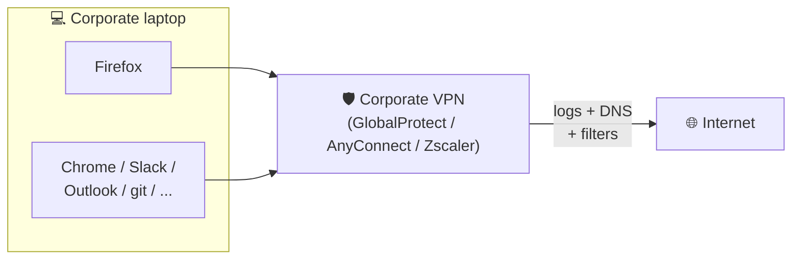
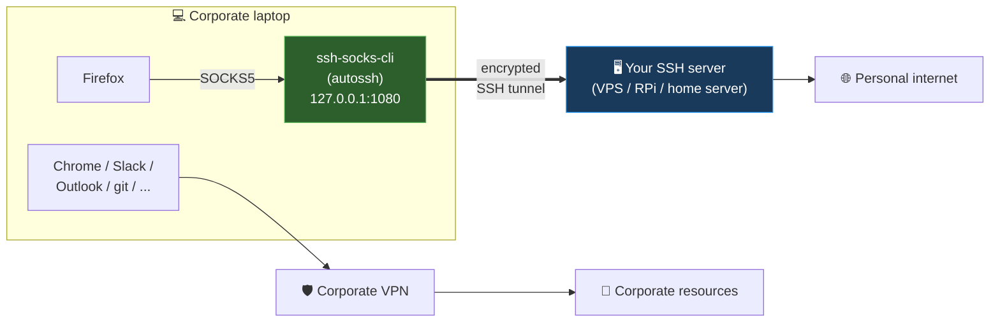
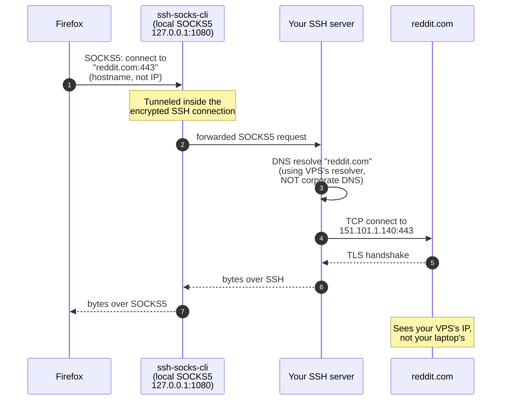

# ssh-socks-cli

> Route Firefox traffic **around** your corporate VPN via an SSH SOCKS5 tunnel — without wrestling with `ssh -D`, autossh flags, or Firefox's proxy pane.

[](LICENSE)
[](https://www.python.org/)
[]()

## What problem does this solve?

You work on a corporate laptop with an **always-on VPN** — Palo Alto **GlobalProtect**, Cisco **AnyConnect**, **Zscaler**, or similar. Your employer routes every byte of traffic through their gateway, and you'd rather keep *personal* browsing (webmail, banking, social media, geo-restricted streaming) outside that tunnel. Or you're testing a service as an external user from the same machine. Or you just want separation between work and personal contexts.

The traditional workaround is:
1. SSH into a personal VPS or home server with `ssh -D 1080 user@host`
2. Open Firefox's network settings and manually configure SOCKS5 on 127.0.0.1:1080
3. Remember to enable "Proxy DNS when using SOCKS v5" (or leak your DNS through the corporate resolver)
4. Do it all over again every time you reboot

**ssh-socks-cli** automates all of that in one CLI.

## ⚠️ You need an SSH exit server

**This tool is useless without one.** `ssh-socks-cli` is a **client** — it manages the connection from your laptop to an SSH server *you already own*, and tunnels Firefox traffic through it. **The server is the part that actually exits to the internet on your behalf.** Your Firefox's public IP becomes whatever that server's public IP is.

Any of the following works, as long as it runs `sshd` and is reachable from your laptop:

- **A VPS** (DigitalOcean, Hetzner, Linode, OVH, Vultr, AWS Lightsail, Fly.io, …). $3–6/month is plenty. Most reliable option, works from anywhere you have internet.
- **A Raspberry Pi running 24/7 at home.** Requires your router to port-forward SSH (and ideally a dynamic-DNS service like DuckDNS or Cloudflare Tunnel if your ISP doesn't give you a static IP). **An RPi Zero 2W is enough** — this workload is tiny.
- **A home server / NAS** with SSH exposed (Synology, Unraid, TrueNAS, …).
- **An old laptop or mini-PC** left plugged in at home running Linux.
- **A friend's server** where you have an account — only if you trust them, because *all your Firefox traffic will exit from there*.

**What the server needs:**
- `sshd` running and reachable on some port (22 or custom).
- Your SSH public key in `~/.ssh/authorized_keys` for the user you'll connect as.
- Outbound internet access.
- **That's it.** No extra software, no SOCKS5 daemon — OpenSSH's `-D` flag *is* a SOCKS5 server, built in.

**What the server does NOT need:**
- A public static IP (dynamic DNS works).
- A SOCKS5 server, Shadowsocks, V2Ray, or anything like that.
- Significant resources. An RPi Zero 2W or a $3/month VPS handles this trivially.

**Before running `ssh-socks init`, verify you can already SSH in manually:**
```bash
ssh user@your-server.example.com
# If that works, you're ready. If it doesn't, fix your SSH access first —
# ssh-socks-cli cannot help you debug an unreachable server.
```

## How it works

### Before — corporate VPN captures everything



Every byte your laptop sends goes through the corporate gateway. Your employer sees all DNS lookups, can block content, and logs connections.

### After — Firefox exits through your own server



Only **Firefox** is re-routed. Every other app (Chrome, Slack, Outlook, git, your IDE) keeps using the corporate VPN exactly as before. The corporate VPN is not bypassed for those — this is a split-tunnel, not a full bypass.

### What happens on a single Firefox request



Key point: the **hostname** is resolved at the VPS, not at your laptop. That's what `network.proxy.socks_remote_dns = true` buys you — without it, Firefox would ask the local OS resolver (= corporate DNS pushed by GlobalProtect) before sending the request through the tunnel, leaking every domain you visit to your employer.

## Features

- **One-command tunnel lifecycle** — `start`, `stop`, `status`, `restart`, `logs`
- **Firefox integration** — writes the correct `user.js` preferences with DNS-leak protection and WebRTC hardening, automatically detecting your default profile
- **Auto-reconnect** via `autossh` when available, falling back to plain `ssh` with aggressive keep-alives
- **`doctor` command** — diagnoses missing binaries, key file permissions, host reachability, and best-effort corporate VPN detection
- **XDG-compliant config** — lives at `~/.config/ssh-socks-cli/config.toml` (Linux/macOS) or `%APPDATA%\ssh-socks-cli\` (Windows)
- **Zero heavy dependencies** — no `paramiko`, no `cryptography`. Shells out to system `ssh`/`autossh`
- **Cross-platform** — macOS, Linux, Windows (native OpenSSH client)

## Prerequisites

**On your laptop:**
- Python **3.11+**
- `ssh` (OpenSSH client) — any modern macOS, Linux, or Windows 10/11 already has it
- `autossh` *(optional but strongly recommended)* — for automatic reconnection when your network flaps
  - macOS: `brew install autossh`
  - Debian/Ubuntu: `sudo apt install autossh`
  - Fedora/RHEL: `sudo dnf install autossh`
  - Arch: `sudo pacman -S autossh`
- Firefox (obviously) — other browsers are out of scope for v0.1

**On your exit server:** see the [SSH exit server](#-you-need-an-ssh-exit-server) section above. TL;DR: anything running `sshd` that you can SSH into manually — a VPS, a Raspberry Pi at home, a NAS, whatever.

## Installation

```bash
pip install ssh-socks-cli
```

Or from source:

```bash
git clone https://github.com/sergioarojasm98/ssh-socks-cli.git
cd ssh-socks-cli
pip install -e .
```

## Quick start

```bash
# 1. Interactive setup — writes ~/.config/ssh-socks-cli/config.toml
ssh-socks init

# 2. Verify your environment is ready
ssh-socks doctor

# 3. Start the tunnel in the background
ssh-socks start

# 4. Configure Firefox to use it (detects default profile automatically)
ssh-socks firefox apply

# 5. Restart Firefox — done. Your Firefox traffic now exits from your SSH server.
```

To verify it's working, visit a site like `https://ifconfig.me` in Firefox. The IP should match your SSH server, not your corporate gateway.

## Command reference

| Command | Description |
|---|---|
| `ssh-socks init` | Interactively create the config file |
| `ssh-socks start` | Start the SOCKS5 tunnel in the background |
| `ssh-socks stop` | Stop the running tunnel |
| `ssh-socks restart` | Stop + start |
| `ssh-socks status` | Show tunnel status (running/stopped, PID, endpoint) |
| `ssh-socks logs [-f] [-n N]` | Show tunnel log (tail or follow) |
| `ssh-socks doctor` | Run environment diagnostics |
| `ssh-socks config show` | Print current configuration |
| `ssh-socks config path` | Print config file path |
| `ssh-socks firefox show` | Print the `user.js` block to stdout |
| `ssh-socks firefox apply` | Inject the block into the default profile's `user.js` |
| `ssh-socks firefox reset` | Replace the apply block with a defaults-restoring block |
| `ssh-socks firefox purge` | Remove any ssh-socks-cli block from `user.js` entirely |
| `ssh-socks firefox profiles` | List detected Firefox profiles |
| `ssh-socks --version` | Show version |

## Configuration file

Example `~/.config/ssh-socks-cli/config.toml`:

```toml
[tunnel]
host = "proxy.example.com"
user = "sergio"
port = 22
identity_file = "~/.ssh/id_ed25519"
local_port = 1080
bind_address = "127.0.0.1"
compression = true
server_alive_interval = 30
server_alive_count_max = 3
connect_timeout = 10
strict_host_key_checking = "accept-new"
# use_autossh = true   # omit to auto-detect

[firefox]
proxy_dns = true       # critical: prevents DNS leaks through corporate DNS
bypass_list = "localhost, 127.0.0.1"
disable_webrtc = true  # WebRTC can leak your real IP even through SOCKS5
```

## What does the Firefox block actually do?

`ssh-socks firefox apply` injects a clearly-delimited block into your profile's `user.js`:

```javascript
// BEGIN ssh-socks-cli managed block (do not edit manually)
user_pref("network.proxy.type", 1);
user_pref("network.proxy.socks", "127.0.0.1");
user_pref("network.proxy.socks_port", 1080);
user_pref("network.proxy.socks_version", 5);

// DNS leak prevention (both old and Firefox-128+ pref names)
user_pref("network.proxy.socks_remote_dns", true);
user_pref("network.proxy.socks5_remote_dns", true);
user_pref("network.dns.disablePrefetch", true);
user_pref("network.dns.disablePrefetchFromHTTPS", true);

// Force proxy, never fall back to direct (which would leak via the VPN)
user_pref("network.proxy.failover_direct", false);
user_pref("network.proxy.allow_bypass", false);

// Disable DoH (TRR) — would race the SOCKS tunnel and leak DNS
user_pref("network.trr.mode", 5);

// Disable speculative connections / prefetch (they bypass the proxy)
user_pref("network.http.speculative-parallel-limit", 0);
user_pref("network.predictor.enabled", false);
user_pref("network.prefetch-next", false);

// Disable captive portal / connectivity probes that hit Mozilla directly
user_pref("network.captive-portal-service.enabled", false);
user_pref("network.connectivity-service.enabled", false);

// WebRTC leak prevention
user_pref("media.peerconnection.enabled", false);
// END ssh-socks-cli managed block
```

Each block is there for a reason:

| Pref | Why |
|---|---|
| `network.proxy.type=1` | Enable manual proxy mode |
| `network.proxy.socks*` | Point Firefox at `127.0.0.1:1080` as SOCKS v5 |
| `network.proxy.socks_remote_dns` + `socks5_remote_dns` | **Critical** — DNS resolution happens at the SSH server, not through your corporate resolver. Firefox 128 introduced a new pref name; we set both. |
| `network.trr.mode=5` | **Critical** — disable DNS-over-HTTPS. Otherwise Firefox would race TRR against the SOCKS tunnel and leak DNS. |
| `network.proxy.failover_direct=false` + `allow_bypass=false` | If the tunnel drops, Firefox will NOT silently fall back to direct (i.e., the VPN). |
| `network.http.speculative-parallel-limit=0`, `predictor.enabled=false`, `prefetch-next=false` | Firefox opens speculative TCP connections before the proxy is consulted; disable them. |
| `network.captive-portal-service.enabled=false` | Firefox pings `detectportal.firefox.com` directly on startup, bypassing the proxy. |
| `media.peerconnection.enabled=false` | WebRTC can bypass the SOCKS proxy and leak your real LAN IP. |

### Reverting Firefox changes (two-step)

Firefox copies `user_pref` values into `prefs.js` at shutdown, so simply deleting the apply block from `user.js` is not enough to undo the previous session's changes. The rollback is therefore a two-step operation:

1. **`ssh-socks firefox reset`** — replaces the apply block with a *defaults-restoring* block that sets every touched pref back to its Firefox factory value. **Restart Firefox once.** On that restart, Firefox overwrites `prefs.js` with the defaults.
2. **`ssh-socks firefox purge`** — removes the block from `user.js` entirely, leaving the rest of your prefs intact.

Your existing `user.js` is backed up to `user.js.sshsocks-backup-<timestamp>` before every write.

## Security notes

- **This is not a VPN.** It's a SOCKS5 proxy for Firefox only. Other apps on your machine still use the corporate VPN unless you configure them separately.
- **You control the exit server.** All Firefox traffic goes through *your* SSH host. Pick a host you trust.
- **Corporate policy.** Check whether your employer permits split-tunneling. This tool does not try to hide its existence — if your company runs DLP/EDR, they can likely see that you have an SSH session open. Use at your own discretion.
- **Key file permissions.** `ssh-socks doctor` will warn you if your private key has loose permissions. Fix with `chmod 600 ~/.ssh/id_ed25519`.
- **Host key checking.** Defaults to `accept-new` (TOFU on first connect, strict thereafter). You can tighten this in the config.

## Troubleshooting

**`ssh-socks start` exits immediately.**
Run `ssh-socks logs` — the SSH error is captured verbatim. The most common causes are wrong host/user, bad key, or the local port already in use.

**Firefox still uses the corporate VPN.**
1. Did you actually restart Firefox after `ssh-socks firefox apply`? `user.js` is only read on startup.
2. Go to `about:preferences#general` → Network Settings. It should show "Manual proxy configuration" with SOCKS host `127.0.0.1` and port `1080`.
3. Visit `about:config` and search `network.proxy.socks` — confirm the values are what you expect.

**DNS still resolves through my company.**
Confirm `network.proxy.socks_remote_dns` is `true` in `about:config`. Visit `https://dnsleaktest.com` in Firefox to confirm.

**The tunnel drops every few minutes.**
Install `autossh` — it will automatically reconnect. Check `ssh-socks doctor` to confirm it was picked up.

## Comparison with alternatives

| Option | Pros | Cons |
|---|---|---|
| Manual `ssh -D 1080` | Zero install | Forget on reboot, no status, no Firefox help, no auto-reconnect |
| FoxyProxy extension | Rich per-URL routing | You still need to run the SSH tunnel yourself |
| `ssh-socks-cli` | Tunnel lifecycle + Firefox config + doctor in one tool | You need an SSH server |
| Commercial VPN | Any browser, any traffic | Monthly cost, another company in your traffic path |

## Development

```bash
git clone https://github.com/sergioarojasm98/ssh-socks-cli.git
cd ssh-socks-cli
pip install -e ".[dev]"
pytest
ruff check .
mypy src
```

## License

MIT — see [LICENSE](LICENSE).

## Author

Built by [Sergio Rojas](https://github.com/sergioarojasm98) — Senior Technical & AI Ops Engineer who got tired of typing `ssh -D 1080` every morning.
